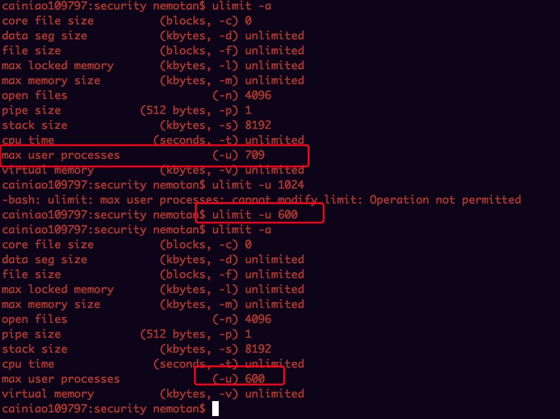

# 

[toc]

## 1. telnet localhost 2181 => conf

## 2. cons

echo cons | nc localhost 2181

## 3. crst

## 4. dump

## 5. envi

## 6. jvm zookeeper jvm优化

这里继续回顾一下常用的命令：

-  jstack

	- 观察jvm中当前所有线程的运行情况和线程当前状态。
	- 系统崩溃了？如果java程序崩溃生成core文件，jstack工具可以用来获得core文件的java stack和native stack的信息，从而可以轻松地知道java程序是如何崩溃和在程序何处发生问题。
	- 系统hung住了？jstack工具还可以附属到正在运行的java程序中，看到当时运行的java程序的java stack和native stack的信息, 如果现在运行的java程序呈现hung的状态，jstack是非常有用的。

- jstat
	
	- jstat利用JVM内建的指令对Java应用程序的资源和性能进行实时的命令行的监控，包括了对进程的classloader，compiler，gc情况；
	- 特别的，一个极强的监视内存的工具，可以用来监视VM内存内的各种堆和非堆的大小及其内存使用量，以及加载类的数量。

-  jmap（Memory Map）和jhat（Java Heap Analysis Tool）
	
	- 监视进程运行中的jvm物理内存的占用情况，该进程内存内，所有对象的情况，例如产生了哪些对象，对象数量；
	- 系统崩溃了？jmap 可以从core文件或进程中获得内存的具体匹配情况，包括Heap size, Perm size等等

- jinfo 
	- 观察进程运行环境参数，包括Java System属性和JVM命令行参数
	- 系统崩溃了？jinfo可以从core文件里面知道崩溃的Java应用程序的配置信息。

jmap用来查看堆内存使用状况，一般结合jhat使用。

查看zookeeper jvm堆使用情况：
	
	jmap -heap processid

修改jvm内存：

修改JVM内存：

## 7. 优化文件句柄和用户线程数的优化

Linux对于每个用户，系统限制其最大进程数。为提高性能，可以根据设备资源情况，设置各linux 用户的最大进程数。可以用ulimit -a 来显示当前的各种用户进程限制。

ulimited命令如下：

- -a 列出所有当前资源极限
- -c 设置core文件的最大值.单位:blocks
- -d 设置一个进程的数据段的最大值.单位:kbytes
- -f Shell 创建文件的文件大小的最大值，单位：blocks
- -h 指定设置某个给定资源的硬极限。如果用户拥有 root 用户权限，可以增大硬极限。任何用户均可减少硬极限
- -l 可以锁住的物理内存的最大值
- -m 可以使用的常驻内存的最大值,单位：kbytes
- -n 每个进程可以同时打开的最大文件数
- -p 设置管道的最大值，单位为block，1block=512bytes
- -s 指定堆栈的最大值：单位：kbytes
- -S 指定为给定的资源设置软极限。软极限可增大到硬极限的值。如果 -H 和 -S 标志均未指定，极限适用于以上二者
- -t 指定每个进程所使用的秒数,单位：seconds
- -u 可以运行的最大并发进程数
- -v Shell可使用的最大的虚拟内存，单位：kbytes

修改用户的文件数：

修改进程数：

